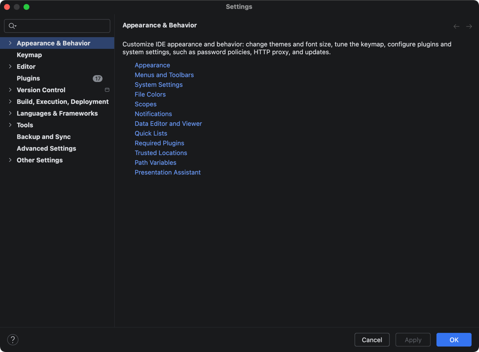
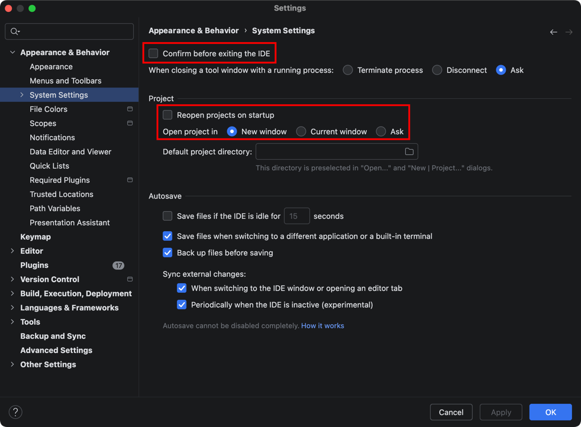

# 常用设置
打开设置页面。

## 设置页面介绍
- Appearance & Behavior：外观和行为
- Keymap：快捷键
- Editor：编辑器
- Plugins：插件
- Version Control：版本控制
- Build, Exception, Deployment：构建，执行，部署
- Languages & Frameworks：语言和框架
- Tools：工具集
- Backup and Sync：备份和同步
- Advanced Settings：高级设置
- Other Settings：其他设置

## Appearance & Behavior 外观和行为

### System Settings 系统设置
- Confirm before exiting the IDE：取消勾选，退出 IDE 前确认提示。
- Reopen projects on startup：取消勾选，启动时默认打开之前的项目。
- Open project in：选择 New windows，设置在新的窗口打开新项目。

## Keymap 快捷键

## Editor 编辑器

## Plugins 插件

## Version Control 版本控制

## Build, Exception, Deployment 构建，执行，部署

## Languages & Frameworks 语言和框架

## Tools 工具集

## Backup and Sync 备份和同步

## Advanced Settings 高级设置

## Other Settings 其他设置

